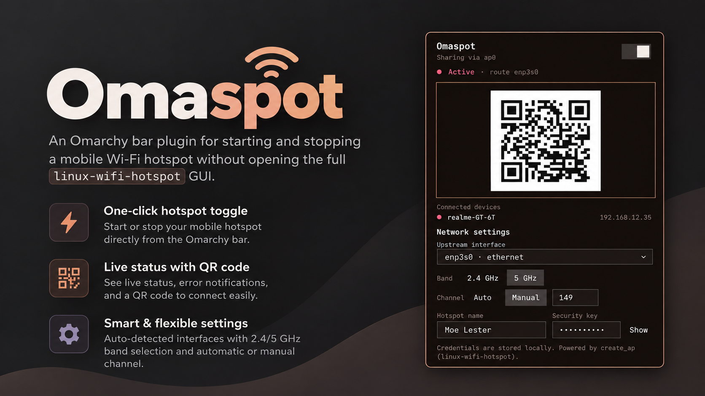

# Omaspot

Omaspot is an Omarchy bar plugin for starting and stopping a mobile Wi-Fi
hotspot without opening the full `linux-wifi-hotspot` GUI. It uses the same
`create_ap` backend as the `linux-wifi-hotspot` AUR package and follows the
Omarchy shell's native theme and panel conventions.

Features:

- One-click hotspot toggle from the Omarchy bar
- Live status and useful error notifications
- QR code that appears while the hotspot is active
- List of recently connected clients, with the currently associated ones marked
- Auto-detected Wi-Fi and upstream interfaces
- 2.4 GHz and 5 GHz band selection
- Automatic or manual channel selection
- Persistent per-user settings stored outside the plugin checkout
- Credentials sent over stdin instead of command-line arguments
- Checks its own dependencies and offers the install command when one is missing

## Requirements

Omaspot drives `create_ap` from
[linux-wifi-hotspot](https://github.com/lakinduakash/linux-wifi-hotspot), the
same engine the `wihotspot` GUI uses, plus a few supporting commands:

| Command | Package | Used for | Required |
| --- | --- | --- | --- |
| `create_ap` | `linux-wifi-hotspot` | the hotspot itself | yes |
| `pkexec` | `polkit` | running `create_ap` as root | yes |
| `nmcli` | `networkmanager` | interface discovery | yes |
| `stat` | `coreutils` | instance state ownership checks | yes |
| `qrencode` | `qrencode` | the QR image | only for the QR |
| `iw` | `iw` | marking associated devices | only for those markers |

`create_ap` runs `hostapd` and `dnsmasq` as root and drives interfaces with
`iproute2`; those arrive as dependencies of `linux-wifi-hotspot`.

### You do not have to install these first

There is no prerequisite step. The first time you open the panel it checks
everything above, and if something required is missing it replaces the hotspot
controls with the list of missing packages and a ready-to-run `yay` command
with a **Copy** button. Run that command in a terminal, reopen the panel, and
it carries on as normal. See [First run](#first-run).

Only a genuinely required package replaces the controls. Without `qrencode`
you lose the QR image, and without `iw` you lose the currently-associated
markers — but a hotspot still starts in both cases, so neither hides the UI.

If you would rather install everything up front:

```sh
yay -S --needed linux-wifi-hotspot qrencode iw
```

`qrencode` and `iw` are dependencies of `linux-wifi-hotspot`, so naming them
is only for clarity — `--needed` skips any that are already present.
NetworkManager and polkit are normally already present on Omarchy.

To check the same state from a terminal:

```sh
backend/omaspotctl doctor
```

## Install

Omarchy accepts `plugin install` as an alias for `plugin add`. Install and
enable Omaspot with:

```sh
omarchy plugin install https://github.com/DeV-433/Omaspot.git --enable --yes
```

The equivalent command on Omarchy versions that show the newer verb is:

```sh
omarchy plugin add https://github.com/DeV-433/Omaspot.git --enable --yes
```

The installer validates `manifest.json`, places the plugin under
`~/.config/omarchy/plugins/io.github.devanshu.omaspot`, rescans the shell, and
adds the widget to the bar. Omit `--enable` if you want to install it first
and enable it later:

```sh
omarchy plugin enable io.github.devanshu.omaspot
```

Omaspot runs as plugin code inside the long-lived Omarchy shell process. Review
the repository before installing plugins from any source you do not trust.

Installing the plugin is the only setup step. Click the bar icon afterwards:
if a required package is missing, the panel tells you which one and hands you
the command to run — see [First run](#first-run).

## First run

The check runs on **every** open, not just the first, so returning from a
terminal after installing is enough — there is nothing to reload and no
restart to perform. The toggle is hidden while the gate is up, and a start is
refused outright, so a hotspot can never be launched without `create_ap`
behind it.

The check comes from `omaspotctl doctor`, which reports each dependency as
`ok` or `missing` and labels it `blocking` or `optional`; it also composes the
`yay` command, so the copyable string is built in one place instead of being
assembled in QML.

The copy button uses `wl-copy` from `wl-clipboard`, quoted with
`Util.shellQuote` so the command reaches it as a single argument. Omaspot
checks the install command matches a plain `yay -S --needed <packages>` shape
before offering it, so a malformed or spoofed backend response cannot put
arbitrary text on the clipboard.

## Defaults and settings

A fresh installation starts with these safe, generic defaults:

- Hotspot name: `Omaspot`
- Security key: `omaspot123` — change this before sharing the network
- Band: `2.4 GHz`
- Channel: automatic
- Upstream interface: automatic detection

The repository contains no machine-specific SSID, password, interface, or
state file. Once you edit settings, Omaspot stores them locally at:

```text
~/.local/state/omarchy/settings/io.github.devanshu.omaspot.json
```

That file is not part of the plugin repository and is never uploaded by the
plugin installer.

## Use

Click the Omaspot icon in the bar to open the panel. Choose the upstream
interface, band, and channel policy if needed, update the hotspot name and
security key, then use the switch. The QR code is generated only while the
hotspot is active. While it is active, the panel also lists the clients that
have joined most recently; the list scrolls rather than growing the flyout.

If another application already started `create_ap`, Omaspot detects it and
can stop it through the same backend. It also loads `/etc/create_ap.conf` when
present, while the panel's live band, channel, and credentials take priority.

## Development

Validate the plugin from a checkout with:

```sh
omarchy plugin validate .
```

Optional local checks:

```sh
node - <<'NODE'
const model = require('./Model.js')
const defaults = model.defaults()
if (defaults.band !== '2.4' || defaults.channelMode !== 'auto') {
  throw new Error('unexpected defaults')
}
console.log('Model defaults OK')
NODE

bash -n backend/omaspotctl
```

The backend exposes the small protocol used by the QML panel:
`status`, `interfaces`, `deps`, `doctor`, `clients`, `start`, `stop`, and `qr`.

`clients` is read-only and never escalates: it reports the tab-separated
`mac`, `ip`, `hostname`, `state` of each client it finds, newest lease first.
It reads the validated instance state directory plus the unprivileged `iw`
station table rather than `create_ap --list-clients`, which needs root and
would prompt on every refresh. Hostnames come from DHCP and are therefore
attacker-controlled, so every field is validated against a strict pattern
before it reaches the panel.

## Instance state and trust

`create_ap` records per-instance state under the world-writable `/tmp`, where
any local user can create a `/tmp/create_ap.<iface>.conf.<id>` directory owned
by themselves. Because `create_ap --stop` signals whatever pid it is given, a
planted directory would otherwise turn the stop path into an arbitrary root
signal. Omaspot therefore treats nothing under `/tmp` as trustworthy until it
has been proven root-owned and unwritable by anyone else, refuses symlinks, and
matches every pid against `/proc` — uid, `argv`, and start time — before it
reaches a privileged command.

## License

MIT. See [LICENSE](LICENSE).
